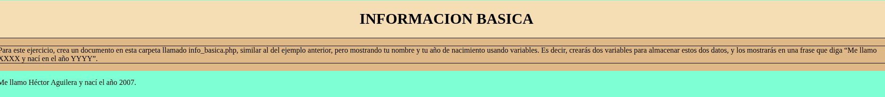
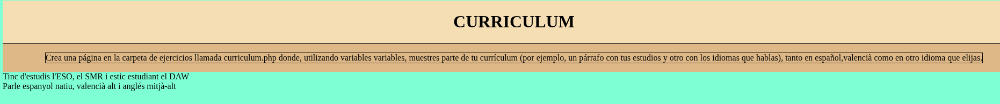
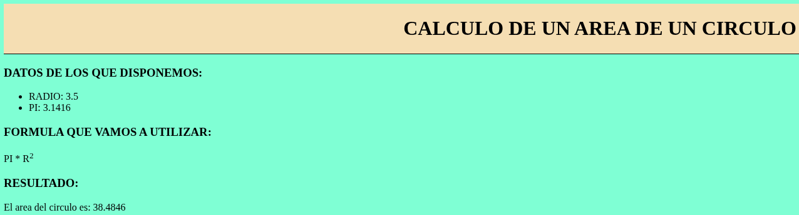
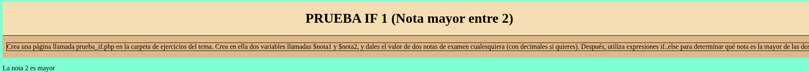
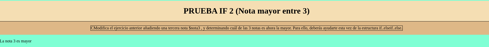
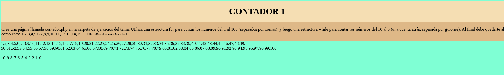
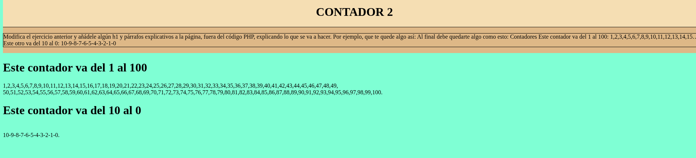

# TEMA 1

## PHP BASICO

### EJERCICIO 1 (info basica)

### EJERCICIO 2 (curriculum)

### EJERCICIO 3 (area circulo)

### EJERCICIO 4 (if_else)

### EJERCICIO 5 (if_else_if)

### EJERCICIO 6 (contador 1)

### EJERCICIO 7 (contador 2)
